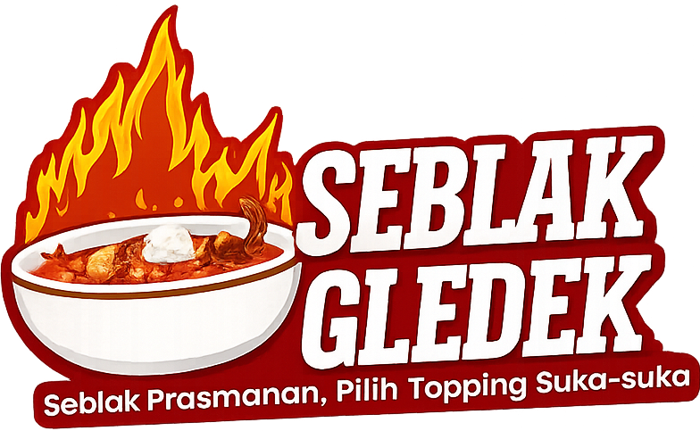
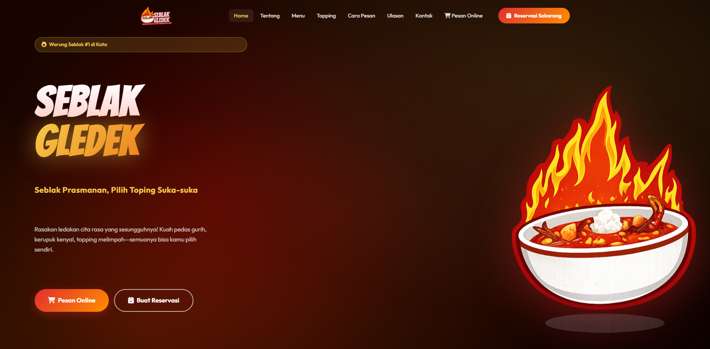

 

<h1 align="center"><b>🔥 SEBLAK GLEDEK WEBSITE 🔥</b></h1>

Website Seblak Gledek adalah website sederhana untuk promosi dan penjualan seblak dengan konsep topping bebas. Website ini dibuat untuk menampilkan menu, menarik pelanggan, serta menyediakan sistem pemesanan online.

## Preview Website

## Fitur

* Landing page dengan branding Seblak Gledek
* Tampilan menu (berbagai varian seblak)
* Konsep pilih topping sesuai selera
* Pemesanan online langsung dari website
* Tombol pemesanan (WhatsApp / kontak)
* Responsive (mobile & desktop)

## Fitur Tambahan

* Halaman admin untuk melihat data reservasi / pesanan
* Menampilkan daftar order dari user
* Memudahkan pengelolaan pesanan

## Sistem Pemesanan

Website ini mendukung pemesanan online, di mana pengguna dapat memilih menu dan langsung melakukan order melalui website. Pesanan dapat dikirim ke WhatsApp atau disimpan sebagai data reservasi untuk dikelola di halaman admin.

## Admin Panel

Website ini dilengkapi dengan halaman admin yang digunakan untuk memantau dan mengelola reservasi atau pesanan dari pelanggan.

Akses halaman admin:

* /admin.html

## Teknologi

* HTML
* CSS
* JavaScript
* Node.js (opsional untuk backend)

## Struktur Project

* public/

  * index.html
  * admin.html
  * css/
  * js/
  * images/
* server.js

## Cara Menjalankan

1. Clone repository
2. Install dependency
   npm install
3. Jalankan server
   node server.js
4. Buka di browser
   [http://localhost:3000](http://localhost:3000)

## Deployment

Project ini dapat di-deploy menggunakan:

* Vercel (frontend saja)
* Railway / Render (Node.js backend)
* VPS (untuk full control)

## Tujuan

Project ini dibuat untuk membantu usaha kecil seperti Seblak Gledek agar dapat memiliki website sendiri dan menjangkau lebih banyak pelanggan secara online.

## Author

Daffa Almerzaky Ariyuda
Indonesia
